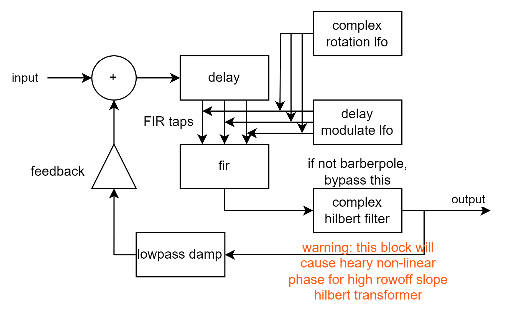
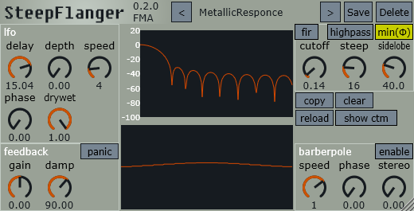

# steep flanger
steep flanger is a FIR flanger plugin.

## features
FIR flanger  
barberpole flanging  

## signal-flow


## gui


## demo
[bilibili](https://www.bilibili.com/video/BV198npzXEPn)  
[youtube](https://www.youtube.com/watch?v=yQ357S2LP2w)  

## MacOS

```bash
sudo xattr -dr com.apple.quarantine /path/to/your/plugins/plugin_name.component
sudo xattr -dr com.apple.quarantine /path/to/your/plugins/plugin_name.vst3
sudo xattr -dr com.apple.quarantine /path/to/your/plugins/plugin_name.lv2
```
## build

```bash
git clone --recurse https://github.com/ManasWorld/SteepFlanger.git

# windows
cmake -G "Ninja" -DCMAKE_C_COMPILER=clang -DCMAKE_CXX_COMPILER=clang -DCMAKE_BUILD_TYPE=Release -S . -B build
cmake --build build --config Release

# linux
sudo apt update
sudo apt-get install libx11-dev libfreetype-dev libfontconfig1-dev libasound2-dev libxrandr-dev libxinerama-dev libxcursor-dev
cmake -G "Unix Makefiles" -DCMAKE_BUILD_TYPE=Release -S . -B .build
cmake --build build --config Release

# macOS
cmake -G "Ninja" -DCMAKE_BUILD_TYPE=Release -DCMAKE_OSX_ARCHITECTURES="x86_64;arm64" -S . -B build
cmake --build build --config Release
```
